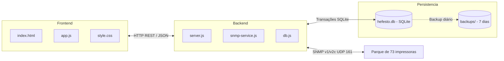

# Arquitetura e rotas da API

> Hub central: [[Projeto Hefesto]]  
> Tags: #projeto-hefesto #api #arquitetura #node #express #snmp

## Visão da arquitetura

O sistema opera com backend em Node.js (Express), consultas SNMP via biblioteca `net-snmp`, persistência em SQLite local (`node:sqlite`) e interface em JavaScript vanilla sem etapa de build.

## Rotas da API

### Volume e previsão
- `GET /api/analytics/volume-forecast`: lista impressoras com contadores diários, semanais e mensais, média diária, suprimento crítico e data estimada de esgotamento.

### Recargas e suprimentos
- `GET /api/recharges`: lista o histórico de recargas cadastradas (filtros opcionais por `printerId`, `unitName` ou `fullOnly`).
- `GET /api/recharges/summary`: mapa com dados da última recarga por impressora.
- `GET /api/recharges/recent-events`: eventos recentes de troca para notificação em tela.
- `POST /api/recharges`: registra substituição manual de suprimento e atualiza o cache.
- `DELETE /api/recharges/:id`: remove um registro de recarga.

### Relatórios e integração
- `GET /api/reports/initial-integration`: relatório de primeira conexão à rede, contadores na ativação, leitura atual e páginas impressas sob monitoramento.
- `GET /api/config/branding`: dados de identidade visual ativa.

### Telemetria e status
- `GET /api/status/all`: status SNMP de todas as impressoras (suporta `?force=true`).
- `GET /api/printers/:id/status`: leitura SNMP detalhada de uma impressora.
- `GET /api/test-ip?ip=...`: teste de conectividade SNMP direto em um IP.

### Cadastro de impressoras e unidades
- `GET /api/printers`, `POST /api/printers`, `PUT /api/printers/:id`, `DELETE /api/printers/:id`
- `GET /api/units`, `POST /api/units`, `PUT /api/units/:id`, `DELETE /api/units/:id`

## Estrutura de tabelas (SQLite)

As tabelas ficam no arquivo `server/data/hefesto.db`, gerenciado por `server/db.js`:

| Tabela | Descrição |
| :--- | :--- |
| `units` | Unidades e filiais cadastradas. |
| `printers` | Cadastro das impressoras com IP, localização e unidade. |
| `printer_status_cache` | Cache da última telemetria lida via SNMP para inicialização rápida do painel. |
| `pending_recharges` | Trocas aguardando a leitura de confirmação de 10 segundos. |
| `recharges` | Histórico permanente de recargas e substituições. |
| `page_history` | Registros diários de contadores para cálculo de volume. |
| `telemetry_snapshots` | Histórico de leituras para cálculo de consumo e previsão. |

O servidor executa backup diário usando `VACUUM INTO` e retém os arquivos dos últimos 7 dias na pasta `server/data/backups/`.

## Links relacionados

- [[Projeto Hefesto]]: visão geral do projeto
- [[Banco de Dados e Persistência SQLite]]: detalhamento do schema e backups
- [[Módulo de Volume e Previsibilidade]]: fórmulas de consumo
- [[Histórico de Recargas e Suprimentos]]: regras de ciclo e recargas
- [[Atualizações]]: histórico de alterações