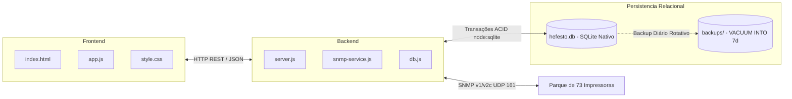

# ⚙️ Arquitetura Técnica & Endpoints da API

> **Hub Central:** [[Projeto Hefesto]]  
> **Tags:** #projeto-hefesto #api #arquitetura #node #express #snmp

---

## 🏗️ Visão da Arquitetura

O sistema é construído sobre uma arquitetura orientada a serviços leves em **Node.js (Express)**, com polling SNMP não-bloqueante (`net-snmp`) e frontend Vanilla JavaScript sem dependências pesadas de compilação.

---

## 📡 Catálogo de Endpoints REST

### 1. Volume & Previsibilidade
- **`GET /api/analytics/volume-forecast`**
  - Retorna a lista de todas as impressoras com contadores diários, semanais, mensais, média/dia, capacidade/workload, suprimento crítico e data projetada de esgotamento.

### 2. Recargas & Suprimentos
- **`GET /api/recharges`**
  - Lista o histórico de recargas registradas (com filtros opcionais por `printerId`, `unitName` ou `fullOnly`).
- **`GET /api/recharges/summary`**
  - Retorna um mapa indexado por `printerId` contendo os dados da última recarga de cada equipamento.
- **`GET /api/recharges/recent-events`**
  - Retorna os eventos de reposição mais recentes para disparo de alertas visuais Toast em tempo real no dashboard.
- **`POST /api/recharges`**
  - Registra manualmente uma recarga de suprimento e atualiza imediatamente o cache de status.
- **`DELETE /api/recharges/:id`**
  - Remove um registro de recarga do histórico.

### 3. Relatórios & Auditoria de Entrada
- **`GET /api/reports/initial-integration`**
  - Retorna o relatório consolidado de primeira conexão à rede, contadores iniciais de entrada, contadores atuais e total produzido sob gestão.
- **`GET /api/config/branding`**
  - Retorna a configuração ativa de identidade visual e marca da aplicação (White-Label).

### 4. Telemetria & Status Operacional
- **`GET /api/status/all`**
  - Retorna o status SNMP em tempo real de todas as impressoras (suporta `?force=true`).
- **`GET /api/printers/:id/status`**
  - Consulta o status detalhado de uma impressora específica.
- **`GET /api/test-ip?ip=...`**
  - Executa um teste de conectividade SNMP direto contra qualquer endereço IP.

### 5. Inventário & Pastas (Unidades)
- **`GET /api/printers`** | **`POST /api/printers`** | **`PUT /api/printers/:id`** | **`DELETE /api/printers/:id`**
- **`GET /api/units`** | **`POST /api/units`** | **`PUT /api/units/:id`** | **`DELETE /api/units/:id`**

---

## 💾 Persistência de Dados Relacional (SQLite ACID)

Toda a persistência do sistema é gerenciada pelo módulo `server/db.js` utilizando o motor **SQLite Nativo (`node:sqlite`)** no banco de dados `server/data/hefesto.db`:

| Tabela | Descrição & Integridade |
| :--- | :--- |
| `units` | Cadastro de pastas das unidades e filiais (SP e RJ). |
| `printers` | Cadastro dos 73 equipamentos, endereços IP únicos, setor e chave estrangeira de unidade. |
| `printer_status_cache` | Cache de telemetria em disco para boot e carregamento instantâneo do dashboard. |
| `pending_recharges` | Memória de confirmação rápida (10s) de reposições atômicas, imune a reinicializações. |
| `recharges` | Histórico permanente e auditável de recargas (oficiais e provisórias). |
| `page_history` | Snapshots diários de contadores de páginas para análise volumétrica. |
| `telemetry_snapshots` | Histórico granular de suprimentos e contadores para os algoritmos de predição. |

> **Segurança & Backups:** Rotina diária automática via `VACUUM INTO` mantendo backups atômicos dos últimos 7 dias em `server/data/backups/`.  
> 🔗 *Documentação detalhada:* [[Banco de Dados e Persistência SQLite]]

---

## 🔗 Ligações do Obsidian
- [[Projeto Hefesto]] — Hub central do projeto
- [[Banco de Dados e Persistência SQLite]] — Camada de persistência relacional e backups
- [[Módulo de Volume e Previsibilidade]] — Regras de negócio de previsão
- [[Histórico de Recargas e Suprimentos]] — Regras de ciclo e recargas
- [[Atualizações]] — Roadmap