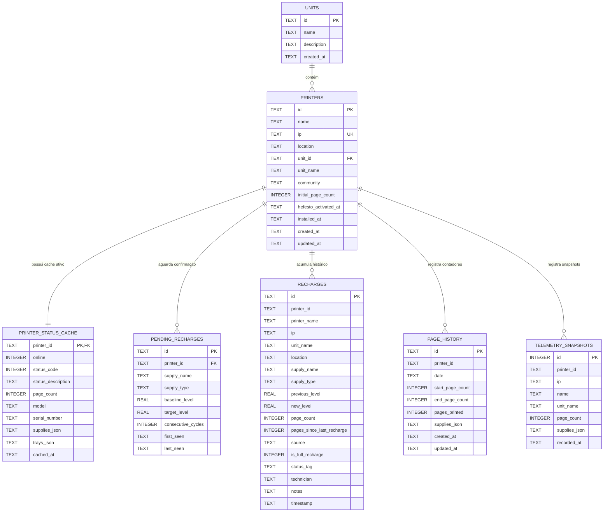

# Banco de dados e persistência SQLite

> Hub central: [[Projeto Hefesto]]  
> Tags: #projeto-hefesto #banco-de-dados #sqlite #persistencia #acid #backup #node24

## Visão geral

O armazenamento do Projeto Hefesto utiliza SQLite local com a biblioteca embutida `node:sqlite` do Node.js v24 (`DatabaseSync`). Essa abordagem dispensa serviços externos de banco em nuvem, não exige ferramentas de compilação em C++ como `node-gyp` e mantém garantias de transação ACID com gravação direta em disco.

O uso do banco local resolve problemas de concorrência e assegura que dados de telemetria, contadores e filas de confirmação de recarga sobrevivam a reinicializações do servidor.

## Modelo entidade-relacionamento

## Dicionário de tabelas

| Tabela | Finalidade | Regras e chaves |
| :--- | :--- | :--- |
| `units` | Unidades e filiais cadastradas. | `id` chave primária. |
| `printers` | Cadastro das impressoras monitoradas. | `ip` único. `unit_id` com `ON DELETE SET NULL`. |
| `printer_status_cache` | Última telemetria válida lida via SNMP. | `printer_id` com `ON DELETE CASCADE`. Acelera o carregamento inicial. |
| `pending_recharges` | Fila de confirmação para trocas em processo de validação. | `printer_id` com `ON DELETE CASCADE`. Mantém o estado durante reinicializações. |
| `recharges` | Histórico permanente de recargas e substituições. | Registra páginas rodadas no ciclo e classificação da troca. |
| `page_history` | Registros diários de contadores para volumetria (hoje, 7 dias, 30 dias). | Independente da exclusão de impressoras para preservar o histórico. |
| `telemetry_snapshots` | Histórico de leituras de níveis de suprimentos. | Base de dados para cálculo de consumo e previsão de término. |

## Backup diário rotativo

O arquivo `server/db.js` executa uma rotina de backup no início do servidor e a cada 24 horas:
- Método: executa `VACUUM INTO 'data/backups/hefesto_backup_YYYY-MM-DD.db'`, gerando uma cópia compacta e consistente enquanto a aplicação segue ativa.
- Retenção: mantém os últimos 7 dias de backups na pasta `server/data/backups/` e remove os arquivos mais antigos automaticamente.

## Migração inicial a partir dos arquivos JSON

Se o arquivo `server/data/hefesto.db` não existir na inicialização:
1. O sistema executa `createSchema()`, criando tabelas e índices.
2. Cria uma cópia de segurança dos arquivos JSON em `server/data/backups/json_pre_sqlite_[timestamp]`.
3. Importa os registros de `units.json`, `printers.json`, `recharges.json`, `page_history.json` e `telemetry_history.json`.

## Links relacionados

- [[Projeto Hefesto]]: visão geral do sistema
- [[Histórico de Recargas e Suprimentos]]: regras de detecção e confirmação
- [[Módulo de Volume e Previsibilidade]]: fórmulas de previsão e métricas de uso
- [[Arquitetura e Endpoints da API]]: catálogo de rotas e persistência
- [[Atualizações]]: histórico de versões e tarefas planejadas
