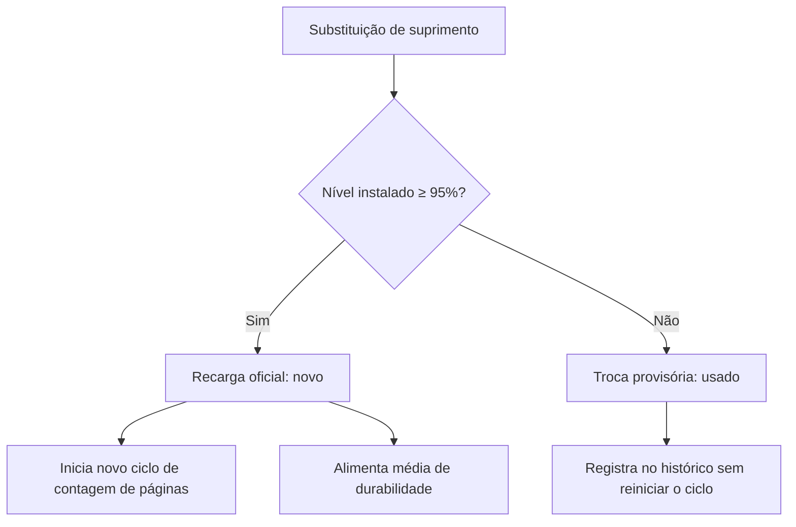

# Histórico de recargas e suprimentos

> Hub central: [[Projeto Hefesto]]  
> Tags: #projeto-hefesto #recargas #suprimentos #auditoria #raiox

## Objetivo e ciclos de troca

O módulo de recargas registra as substituições de toners, bolsas de tinta e garrafas de abastecimento nas impressoras monitoradas. A rotina atende a três finalidades:
1. Auditar as substituições feitas por técnicos ou operadores.
2. Calcular o total de páginas impressas durante a vida útil de cada cartucho ou bolsa.
3. Separar trocas com insumos novos de trocas com insumos reaproveitados.

## Classificação das trocas

- Recarga oficial ($\ge 95\%$): instalação de insumo novo. O sistema usa a data da troca como ponto inicial para o cálculo de rendimento do ciclo.
- Troca provisória ($< 95\%$): uso emergencial de insumo parcialmente consumido. O registro é mantido para consulta, mas não reinicia o cálculo do ciclo principal.

## Modos de registro

### Detecção automática via SNMP

O servidor acompanha as leituras de rede para identificar alterações de suprimento:

1. Leituras a partir de 0%: o sistema registra a troca mesmo quando o nível anterior do suprimento estava zerado, frequente em impressoras de consultórios.
2. Confirmação em 10 segundos: ao detectar aumento de nível, o servidor agenda uma consulta direta após 10 segundos. Se o valor permanecer estável ($\pm 5\%$), a recarga é gravada no banco.
3. Fila persistente (`pending_recharges`): a validação intermediária fica gravada no SQLite, mantendo o acompanhamento mesmo se o servidor for reiniciado durante o procedimento físico.
4. Notificação na interface: o painel consulta `/api/recharges/recent-events` a cada 20 segundos e exibe aviso em tela quando uma substituição for confirmada.

### Registro manual

Técnicos e gestores podem registrar trocas manualmente pelo botão no cabeçalho ou na gaveta de detalhes da impressora:
- Formulário com seleção de equipamento, suprimento, tipo de carga, técnico e observações.
- Gravação direta na tabela `recharges` do SQLite com recálculo das páginas do ciclo.

## Modais sobrepostos

O modal de cadastro manual abre sobre a gaveta de detalhes da impressora (`z-index` superior):
- O operador mantém a visão dos dados da máquina durante o preenchimento.
- Ao salvar, o histórico do equipamento é recarregado sem necessidade de atualizar a página inteira.
- Fechar o modal (com tecla Esc ou clique fora) mantém a gaveta aberta.

## Links relacionados

- [[Projeto Hefesto]]: visão geral do sistema
- [[Banco de Dados e Persistência SQLite]]: estrutura de tabelas e persistência
- [[Módulo de Volume e Previsibilidade]]: estimativa de esgotamento e capacidade
- [[Arquitetura e Endpoints da API]]: rotas da API de recargas
- [[Atualizações]]: histórico de entregas e pendências