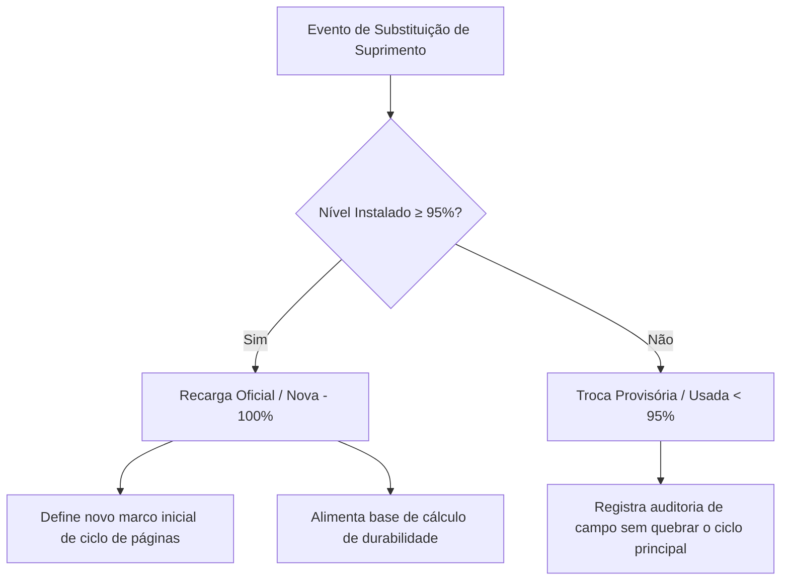

# 🔄 Histórico de Recargas & Auditoria de Suprimentos

> **Hub Central:** [[Projeto Hefesto]]  
> **Tags:** #projeto-hefesto #recargas #suprimentos #auditoria #raiox

---

## 🎯 Objetivo & Conceito de Ciclos

O módulo de histórico de recargas foi projetado para registrar com precisão cada troca de bolsa de tinta, toner ou garrafa de abastecimento no parque corporativo de impressoras, garantindo:
1. **Auditoria completa de trocas** realizadas por técnicos ou operadores.
2. **Cálculo exato de rendimento de páginas** obtidas com cada cartucho/bolsa.
3. **Identificação de trocas provisórias ou cartuchos usados** que não devem distorcer a média histórica.

---

## ⚖️ Regra de Corte: Recarga Oficial vs. Troca Provisória

- **Recarga Oficial (Nova / Cheia $\ge 95\%$):**  
  Quando uma nova bolsa ou toner lacrado é instalado. O sistema define a data como novo marco zero para contagem de durabilidade do suprimento.
- **Troca Provisória (Usada $< 95\%$):**  
  Instalação emergencial de um cartucho parcialmente usado. O evento fica registrado no histórico para auditoria, mas não contamina o ciclo oficial.

---

## 🤖 Modos de Registro: Automático vs. Manual

### 1. Detecção Automática & Motor de Assertividade Máxima (SNMP)
Para atingir precisão máxima e eliminar perdas históricas (como recargas realizadas após esgotamento total em consultórios), o sistema implementa um pipeline de detecção inteligente em 3 etapas:

1. **Aceitação de Baseline $\ge 0\%$:**  
   Diferente de heurísticas frágeis que descartavam níveis inferiores a 5%, o motor agora aceita que um suprimento estivesse em **0%** e tenha sido substituído por uma bolsa/toner novo (salto de $0\% \rightarrow 100\%$).
2. **Confirmação Atômica Rápida em 10 Segundos:**  
   Assim que um salto positivo consistente é detectado no ciclo regular de varredura, o servidor agenda uma reconsulta SNMP atômica para dali a **10 segundos**. Se a leitura se mantiver estável ($\pm 5\%$), a recarga é **confirmada e gravada imediatamente**. Isso elimina a dependência de 3 ciclos longos de polling (30 a 90 minutos).
3. **Persistência de Intenção no SQLite (`pending_recharges`):**  
   A intenção de validação é gravada no banco relacional [[Banco de Dados e Persistência SQLite]]. Mesmo que o servidor seja reiniciado ou que a impressora fique temporariamente offline durante a troca física do cartucho, a transação não se perde.
4. **Alertas Toast em Tempo Real:**  
   O frontend monitora a rota `/api/recharges/recent-events` a cada 20 segundos. Ao confirmar a recarga, exibe instantaneamente um alerta Toast visual na tela com equipamento, setor e salto de percentual.

### 2. Registro Manual no Raio-X
Técnicos e gestores podem registrar uma troca sob demanda diretamente pela interface:
* Acessível pelo botão **`+ Registrar Recarga`** no cabeçalho ou dentro da gaveta **Raio-X**.
* Formulário com seleção de impressora, suprimento, tipo de carga (Oficial 100% vs Parcial), técnico responsável e notas explicativas.
* Gravação imediata na tabela `recharges` do SQLite com recálculo automático de páginas no ciclo.

---

## 🪟 Interface em Camadas (Layered Modals)

Para máxima agilidade operacional, o modal de registro manual abre em uma camada superior (`z-index: 200`) sobre a gaveta do **Raio-X** (`z-index: 100`):
* O técnico não perde o contexto da impressora que está inspecionando.
* Ao salvar, a gaveta do Raio-X atualiza a linha do tempo instantaneamente sem recarregar a página.
* Pressionar `ESC` ou clicar fora fecha apenas o modal de recarga, preservando a gaveta aberta.

---

## 🔗 Ligações do Obsidian
- [[Projeto Hefesto]] — Hub principal de arquitetura
- [[Banco de Dados e Persistência SQLite]] — Camada de persistência relacional e backups
- [[Módulo de Volume e Previsibilidade]] — Motor preditivo e capacidade
- [[Arquitetura e Endpoints da API]] — Rotas `/api/recharges`, `/api/recharges/summary` e `/api/recharges/recent-events`
- [[Atualizações]] — Checklist e roadmap