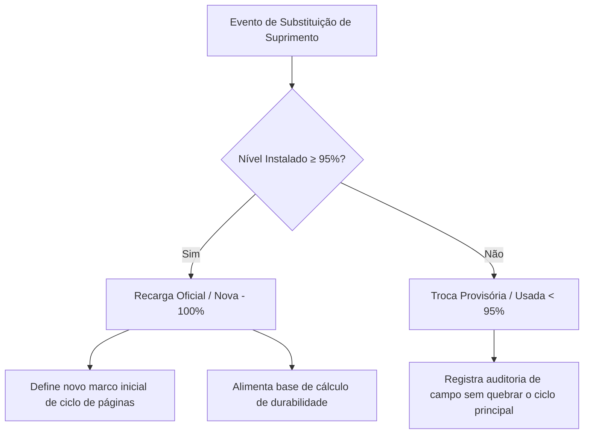

# 🔄 Histórico de Recargas & Auditoria de Suprimentos

> **Hub Central:** [[Projeto Hefesto]]  
> **Tags:** #prevent-senior #projeto-hefesto #recargas #suprimentos #auditoria #raiox

---

## 🎯 Objetivo & Conceito de Ciclos

O módulo de histórico de recargas foi projetado para registrar com precisão cada troca de bolsa de tinta, toner ou garrafa de abastecimento no parque de impressoras da **Prevent Senior**, garantindo:
1. **Auditoria completa de trocas** realizadas por técnicos ou operadores.
2. **Cálculo exato de rendimento de páginas** obtidas com cada cartucho/bolsa.
3. **Identificação de trocas provisórias ou cartuchos usados** que não devem distorcer a média histórica.

---

## ⚖️ Regra de Corte: Recarga Oficial vs. Troca Provisória

- **Recarga Oficial (Nova / Cheia $\ge 95\%$):**  
  Quando uma nova bolsa ou toner lacrado é instalado. O sistema define a data como novo marco zero para contagem de durabilidade do suprimento.
- **Troca Provisória (Usada $< 95\%$):**  
  Instalação emergencial de um cartucho parcialmente usado. O evento fica registrado no histórico para auditoria, mas não contamina o ciclo oficial.

---

## 🤖 Modos de Registro: Automático vs. Manual

### 1. Detecção Automática SNMP (Delta $\ge +20\%$)
A cada ciclo de varredura periódica em segundo plano, o servidor compara os níveis atuais com o cache anterior. Se detectar um acréscimo expressivo de carga ($\ge +20\%$), registra automaticamente o evento no histórico calculando a diferença de páginas impressas.

### 2. Registro Manual no Raio-X
Técnicos e gestores podem registrar uma troca sob demanda diretamente pela interface:
* Acessível pelo botão **`+ Registrar Recarga`** no cabeçalho ou dentro da gaveta **Raio-X**.
* Formulário com seleção de impressora, suprimento, tipo de carga (Oficial 100% vs Parcial), técnico responsável e notas explicativas.

---

## 🪟 Interface em Camadas (Layered Modals)

Para máxima agilidade operacional, o modal de registro manual abre em uma camada superior (`z-index: 200`) sobre a gaveta do **Raio-X** (`z-index: 100`):
* O técnico não perde o contexto da impressora que está inspecionando.
* Ao salvar, a gaveta do Raio-X atualiza a linha do tempo instantaneamente sem recarregar a página.
* Pressionar `ESC` ou clicar fora fecha apenas o modal de recarga, preservando a gaveta aberta.

---

## 🔗 Ligações do Obsidian
- [[Projeto Hefesto]] — Hub principal de arquitetura
- [[Módulo de Volume e Previsibilidade]] — Motor preditivo e capacidade
- [[Arquitetura e Endpoints da API]] — Rotas `/api/recharges` e `/api/recharges/summary`
- [[Atualizações]] — Checklist e roadmap