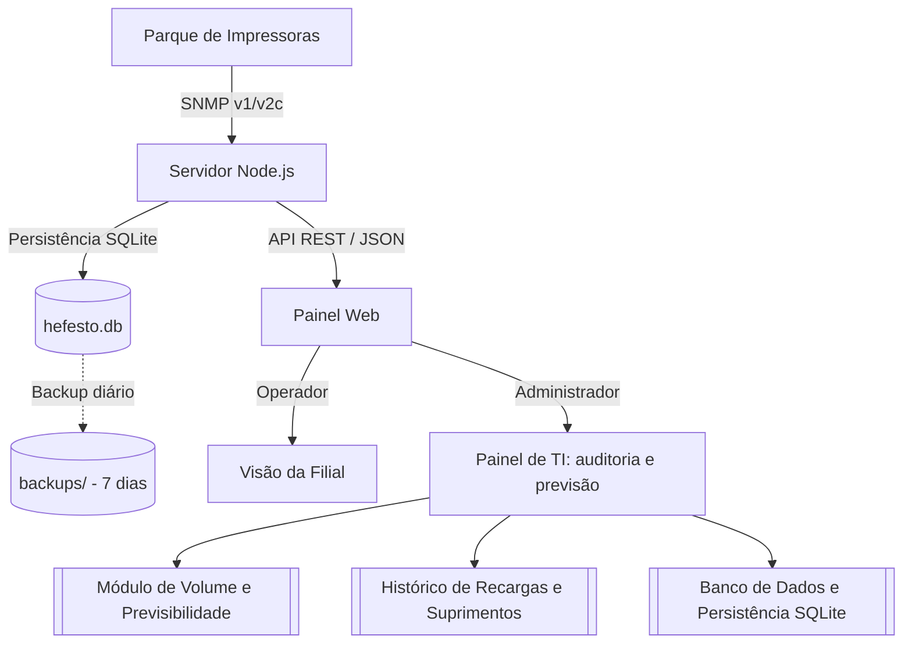

# Projeto Hefesto: monitoramento de impressoras

> Ambiente: produção (intranet)  
> Status: operacional (porta 80)  
> Tags: #projeto-hefesto #impressoras #telemetria #dashboard #snmp

## Visão geral

O Projeto Hefesto monitora o parque de impressoras corporativo via SNMP em tempo real. O sistema atende a dois grupos: os operadores nas filiais, que acompanham os suprimentos da sua unidade, e a equipe de TI, que gerencia contadores, previsão de consumo e histórico de trocas.

## Módulos do sistema

- [[Banco de Dados e Persistência SQLite]]: armazenamento em SQLite local com rotina de backup diário para os últimos 7 dias.
- [[Módulo de Volume e Previsibilidade]]: estimativa de esgotamento de suprimentos, contagem de páginas por período e taxa de uso do equipamento.
- [[Histórico de Recargas e Suprimentos]]: registro de trocas de cartuchos com confirmação rápida e cálculo de rendimento por ciclo.
- [[Relatório Histórico de Início na Rede]]: registro de entrada do equipamento no monitoramento e contadores iniciais.
- [[Arquitetura e Endpoints da API]]: referência técnica das rotas HTTP e estrutura do serviço.
- [[Atualizações]]: histórico de entregas e tarefas planejadas.

## Perfis de acesso

| Recurso | Operador (Unidade) | Administrador (TI) |
| :--- | :---: | :---: |
| Escopo de visualização | Apenas a unidade selecionada | Todas as unidades |
| Status operacional | Sim | Sim |
| Detalhes da impressora (Raio-X) | Sim | Sim |
| Volume e previsibilidade | Não | Sim |
| Histórico de recargas | Não | Sim |
| Exportação de relatórios (CSV) | Não | Sim |
| Gerenciamento de equipamentos | Não | Sim |

## Conectividade e acesso

- Acesso local: `http://localhost/`
- Acesso na intranet: `http://10.1.159.240/`
- Porta: 80 (HTTP padrão)
- Frequência de leitura: consulta automática a cada 30 minutos, com opção de atualização manual na interface.