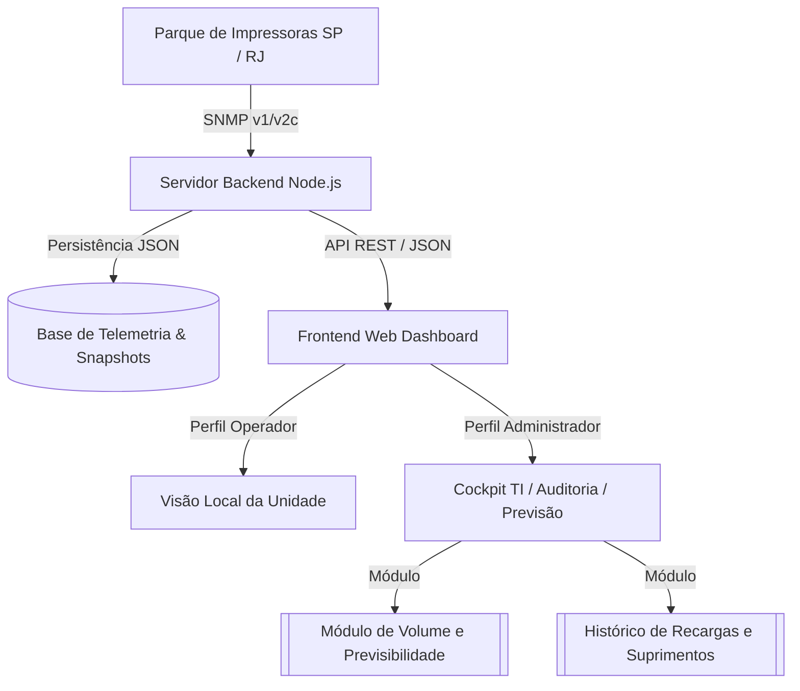

# 🏛️ Projeto Hefesto — Sistema de Monitoramento & Telemetria Prevent Senior

> **Ambiente:** Produção / Intranet Prevent Senior  
> **Status:** 🟢 Operacional (Porta 80)  
> **Tags:** #prevent-senior #projeto-hefesto #impressoras #telemetria #dashboard #snmp

---

## 🧭 Visão Geral & Propósito

O **Projeto Hefesto** é a plataforma corporativa de observabilidade, telemetria SNMP em tempo real e inteligência preditiva de suprimentos para todo o parque de impressoras da **Prevent Senior** (São Paulo e Rio de Janeiro).

O sistema oferece visibilidade operacional para os operadores das unidades locais e ferramentas avançadas de auditoria, volumetria e previsão de trocas para a equipe de Tecnologia da Informação e Gestão de Contratos.

---

## 🧩 Estrutura de Módulos & Ligações

- [[Módulo de Volume e Previsibilidade]] — Motor preditivo de esgotamento de tinta/toner, volume diário/semanal/mensal e classificação de carga.
- [[Histórico de Recargas e Suprimentos]] — Registro de trocas oficiais vs. parciais, telemetria delta SNMP e auditoria com gaveta Raio-X.
- [[Arquitetura e Endpoints da API]] — Especificação técnica dos endpoints REST, persistência em disco e ciclo de vida do backend.
- [[Atualizações]] — Roadmap de implementação e controle de tarefas concluídas e futuras.

---

## 👥 Isolamento de Perfis de Acesso

| Recurso / Visão | Perfil Operador (Unidade) | Perfil Administrador (TI) |
| :--- | :---: | :---: |
| **Escopo de Visualização** | Apenas a Unidade selecionada no login | Visão Global de todas as filiais |
| **Status Operacional em Tempo Real** | ✅ Sim | ✅ Sim |
| **Gaveta de Raio-X com Diagnóstico** | ✅ Sim | ✅ Sim |
| **Aba "Volume & Previsibilidade"** | ❌ Oculto | ✅ Acesso Completo |
| **Histórico de Recargas & Auditoria** | ❌ Oculto | ✅ Acesso Completo |
| **Exportação de Relatórios (CSV/Excel)** | ❌ Oculto | ✅ Acesso Completo |
| **Gerenciamento de Pastas & Equipamentos**| ❌ Oculto | ✅ Acesso Completo |

---

## 🌐 Conectividade & Acesso

- **URL Local:** `http://localhost/`
- **URL Intranet:** `http://10.1.159.240/`
- **Porta:** `80 (HTTP Padrão)`
- **Sincronização Periódica:** Leitura SNMP automática a cada 30 minutos com atualização forçada sob demanda.