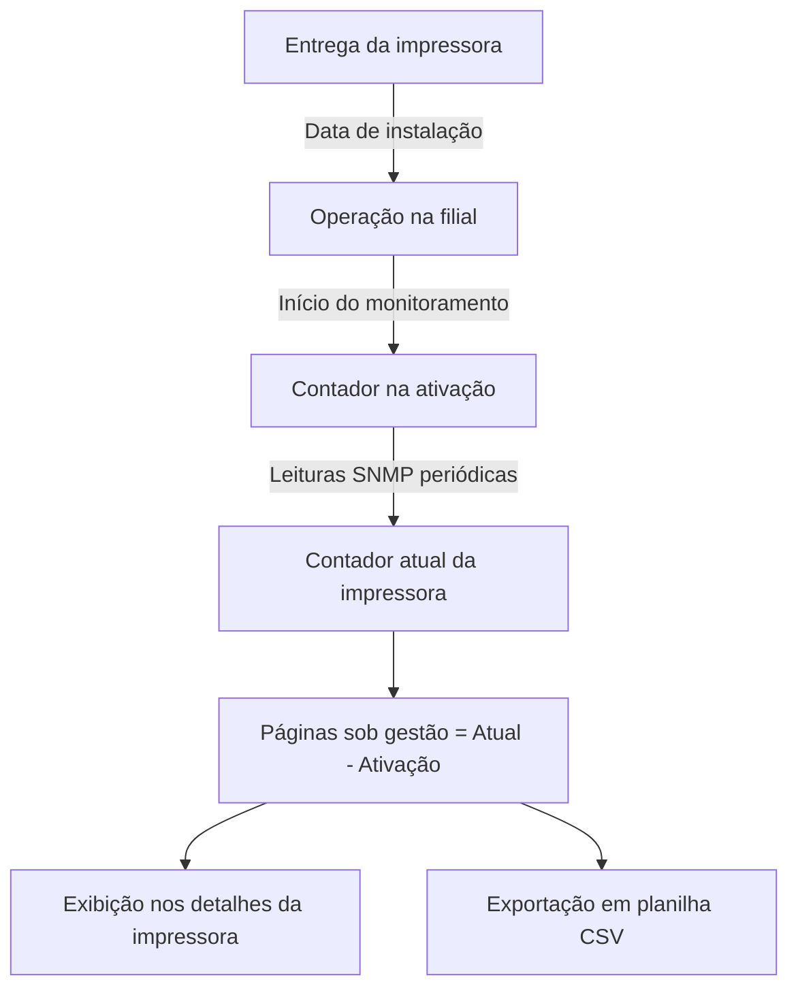

# Relatório de início na rede e contadores iniciais

> Hub central: [[Projeto Hefesto]]  
> Tags: #projeto-hefesto #auditoria #integracao #relatorios #contadores #telemetria

## Objetivo e referências de contagem

Para impressoras que já operavam antes da implantação do sistema, o monitoramento organiza os números em dois marcos de referência:

1. Total vitalício da máquina: contador absoluto acumulado no hardware desde a fabricação.
2. Contador na ativação do monitoramento: leitura registrada no primeiro dia em que o equipamento foi catalogado no sistema (19/08/2026).
3. Páginas produzidas sob monitoramento: diferença entre a leitura atual e a leitura de ativação ($\text{Delta} = \text{Contador Atual} - \text{Contador na Ativação}$).
4. Datas de referência:
   - Data de início do monitoramento: registro automático da primeira leitura SNMP.
   - Data de instalação física ou contrato: campo opcional no cadastro para registrar a entrega do equipamento pelo contrato de locação.

## Regras de cálculo

### 1. Páginas produzidas sob monitoramento
$$\text{Produção sob Gestão} = \max(0, \, \text{Contador Atual Vitalício} - \text{Contador na Ativação})$$

### 2. Média diária de produção
Calculada a partir do volume gerado nos dias monitorados, evitando distorções causadas pelo total vitalício acumulado antes da implantação.

## Onde o recurso está disponível

### 1. Nos detalhes da impressora
Painel com quatro indicadores:
- Total vitalício: contagem acumulada do hardware.
- Contador na ativação: leitura no início do monitoramento.
- Páginas sob gestão: total impresso após a entrada no sistema.
- Data de instalação: data informada pelo contrato de locação.

### 2. Exportação de planilha (CSV)
Botão no cabeçalho com 11 colunas de auditoria:
1. Unidade ou filial
2. Local ou setor
3. Endereço IP
4. Modelo do equipamento
5. Número de série
6. Data de instalação física
7. Data de início do monitoramento
8. Contador na ativação
9. Contador atual da máquina
10. Páginas impressas sob monitoramento
11. Status de conexão

### 3. Edição do cadastro
Permite ajustar manualmente a data de instalação física e o contador inicial caso os dados de contrato sejam recuperados posteriormente.

## Links relacionados

- [[Projeto Hefesto]]: visão geral do sistema
- [[Banco de Dados e Persistência SQLite]]: persistência dos contadores e snapshots
- [[Módulo de Volume e Previsibilidade]]: acompanhamento diário, semanal e mensal
- [[Histórico de Recargas e Suprimentos]]: histórico de substituição de cartuchos
- [[Arquitetura e Endpoints da API]]: rota `GET /api/reports/initial-integration`
- [[Atualizações]]: registro de entregas e tarefas pendentes
