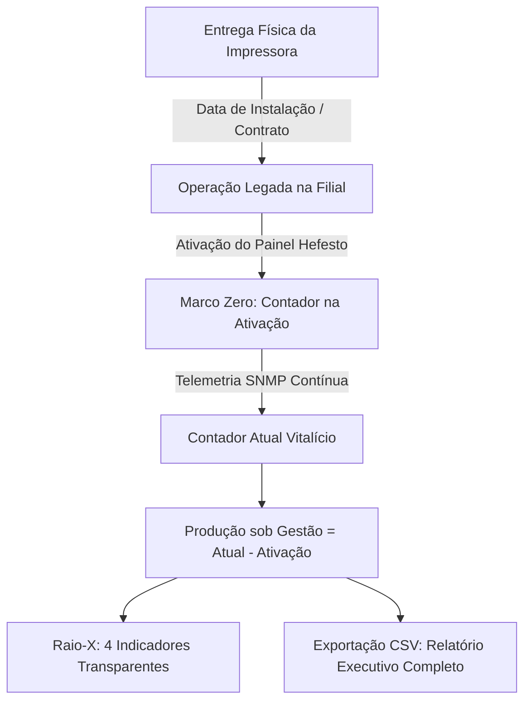

# 📥 Relatório Histórico de Início na Rede & Auditoria Inicial (Modelo Híbrido)

> **Hub Central:** [[Projeto Hefesto]]  
> **Tags:** #projeto-hefesto #auditoria #integracao #relatorios #contadores #telemetria #modelo-hibrido

---

## 🎯 Objetivo & Conceito: O Modelo Híbrido de Contadores

Em parques de impressão corporativos onde as impressoras já estão operando há meses antes da implantação da plataforma de software, o sistema resolve a falta de contadores legados dividindo a auditoria em dois pilares complementares e transparentes:

1. 🏭 **Total Vitalício da Máquina (Hardware):** O contador absoluto acumulado na memória da impressora desde a sua fabricação de fábrica.
2. 🚀 **Contador na Ativação Hefesto (Baseline de Monitoramento):** O marco zero capturado no dia em que o monitoramento passou a acompanhar o equipamento na unidade (19/08/2026).
3. 📈 **Produção sob Gestão Hefesto:** O saldo efetivo de páginas impressas sob o controle da plataforma ($\text{Delta} = \text{Contador Atual} - \text{Contador na Ativação}$).
4. 🏢 **Dupla Rastreabilidade de Datas:**
   - **Data de Início do Monitoramento:** Registro automático da 1ª telemetria SNMP.
   - **Data de Instalação Física / Contrato (Opcional):** Campo editável no cadastro para quando a TI resgatar a data de entrega física ou termo de locação do fornecedor de outsourcing.

---

## 📐 Fórmulas & Regras de Cálculo

### 1. Páginas Produzidas sob Gestão Hefesto
$$\text{Produção sob Gestão} = \max(0, \, \text{Contador Atual Vitalício} - \text{Contador na Ativação})$$

### 2. Média Diária & Volume Semanal / Mensal
Calculada a partir da taxa de produção real da máquina ao longo dos dias monitorados, prevenindo distorções causadas por contadores de vida útil acumulados.

---

## 🏛️ Onde o Recurso Está Disponível

### 1. 🔬 No Raio-X 360° da Impressora
Card em destaque: **"Rastreamento Histórico & Produção sob Gestão"** com 4 blocos:
* **Total Vitalício (Hardware):** Total acumulado desde a fabricação.
* **Contador na Ativação:** Total no dia de início do monitoramento.
* **Produção sob Gestão:** Saldo de páginas impressas sob controle do sistema (+X pág.).
* **Instalação Física:** Data de entrega pelo contrato de outsourcing.

### 2. 📊 No Cabeçalho Administrativo (Exportação CSV)
Botão **`📥 Histórico Inicial CSV`** com 11 colunas de auditoria:
1. `Unidade / Filial`
2. `Local / Setor`
3. `Endereço IP`
4. `Modelo da Impressora`
5. `Número de Série`
6. `Data de Instalação Física (Contrato)`
7. `Data de Início do Monitoramento (Hefesto)`
8. `Contador na Ativação Hefesto (Páginas)`
9. `Contador Atual Vitalício (Páginas)`
10. `Páginas Rodadas sob Gestão Hefesto (Delta)`
11. `Status Operacional Atual`

### 3. ⚙️ No Modal de Cadastro / Edição da Impressora
Permite ajustar individualmente a data de instalação física, contador de ativação e data de início do monitoramento.

---

## 🔗 Ligações do Sistema (Wikilinks)
- [[Projeto Hefesto]] — Hub central da plataforma.
- [[Módulo de Volume e Previsibilidade]] — Análise diária, semanal e mensal de produção.
- [[Histórico de Recargas e Suprimentos]] — Registro de trocas de insumos.
- [[Arquitetura e Endpoints da API]] — Endpoint `GET /api/reports/initial-integration`.
- [[Atualizações]] — Registro de roadmap e entregas.
